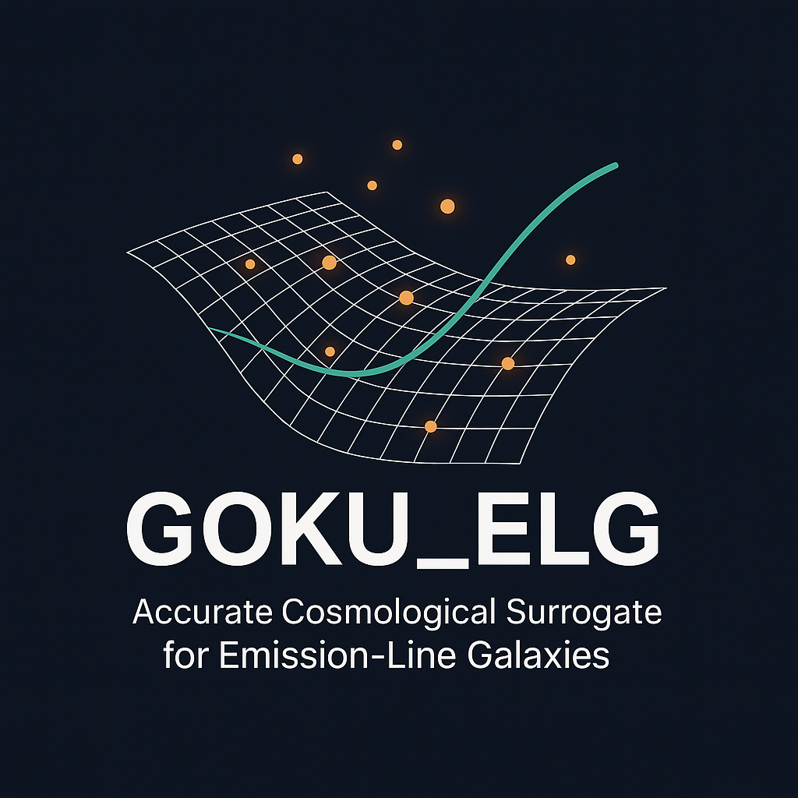
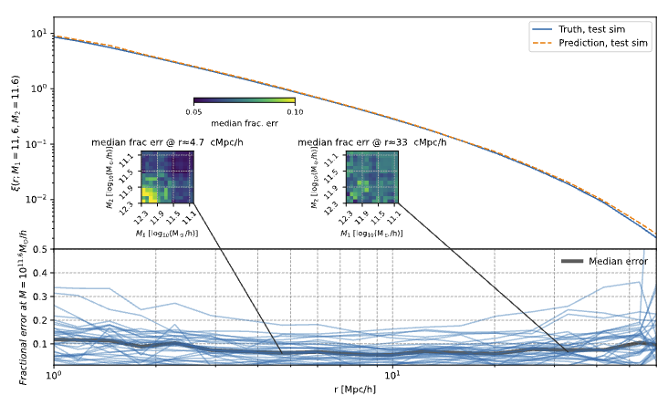
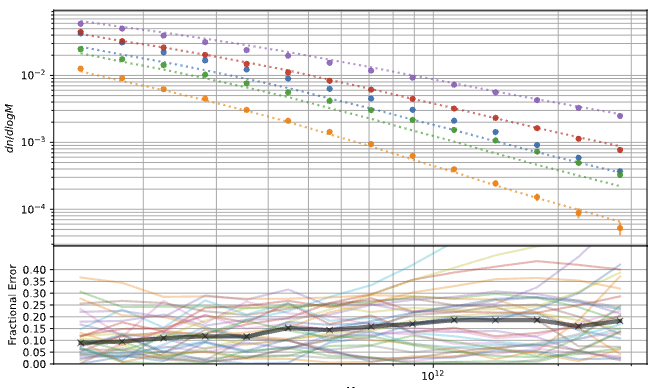
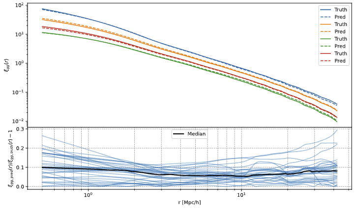

# Goku-ELG: An accurate cosmological surrogate for emission-line galaxies (ELGs)

[](https://github.com/)
[](https://gpflow.github.io/)
[](https://arxiv.org/)


<p align="center">
    
</p>

This is a percent-level accurate surrogate model replacing the expensive N-Body simualtions to model the emission-line galaxy clustering. 


##  For General Audience

### The Problem

Modeling cosmological observations with high fidelity typically requires computationally expensive forward simulations of large-scale structure.
Because these simulations are slow and costly, researchers often resort to simplified or approximate models, sacrificing physical accuracy and precision.

### Our Solution

Using a **Bayesian experimental design** strategy, we carefully select a limited number of simulation runs within a **10-dimensional cosmological parameter space**.
We then train a **multi-fidelity Gaussian Process (GP)** surrogate on these simulation results to emulate the observed clustering signal.

This emulator achieves **percent-level cross-validation accuracy**, enabling **fast and reliable inference** through **Markov Chain Monte Carlo (MCMC)** sampling without the need for repeated, expensive N-body simulations.


### The Validation Test:
The plots below show the accuracy of our surrogate Gaussian Process model for key summary statistics:

<p align="center">
  
  
</p>

and for the final observable summary statistics:
<p align="center">
  
</p>


### Interactive Demo:
Click the icon to open the interactive galaxy-clustering demo.

[](https://qezlou.github.io/gal-clustering-viz/change_one/)


## For Astrophysisits:

A cosmological emulator for emission-line galaxies (ELGs), built using the GOKU simulation suite.

**Qezlou et al., in preparation**


### What's New?

Resolving emission-line galaxies in N-body simulations requires high resolution, while achieving high-fidelity clustering statistics demands large volumes. We address both challenges **efficiently** by using machine learning models trained on the GOKU simulation suite [Yang et al. (2025)](https://ui.adsabs.harvard.edu/abs/2025PhRvD.111h3529Y/abstract).

Our method employs a **multi-fidelity Gaussian Process model** [Kennedy & O'Hagan (2000)](https://academic.oup.com/biomet/article-abstract/87/1/1/221217?redirectedFrom=PDF), [Ho et al. (2021)](https://arxiv.org/abs/2105.01081), along with elements of the [`Stochastic Variational GP`](https://arxiv.org/pdf/1411.2005) framework, extended to support datasets with varying uncertainty levels through a modified likelihood.

---


## Installation

```
python -m pip install emukit
conda create -n gal_goku python=3.12 numpy scipy=1.15.1 matplotlib
python -m pip install scikit-learn

```

```
python -m pip install -e .
```


## Citation

Please cite the upcoming manuscript when using this code:

Qezlou et al., Goku-ELG: A Cosmological Emulator for Emission-Line Galaxies, in preparation (2025).
---

## License

© 2025 Qezlou, Yanhui Yang, Simeon Bird and Ming-Feng Ho. All rights reserved.  
License terms will be provided upon publication.


